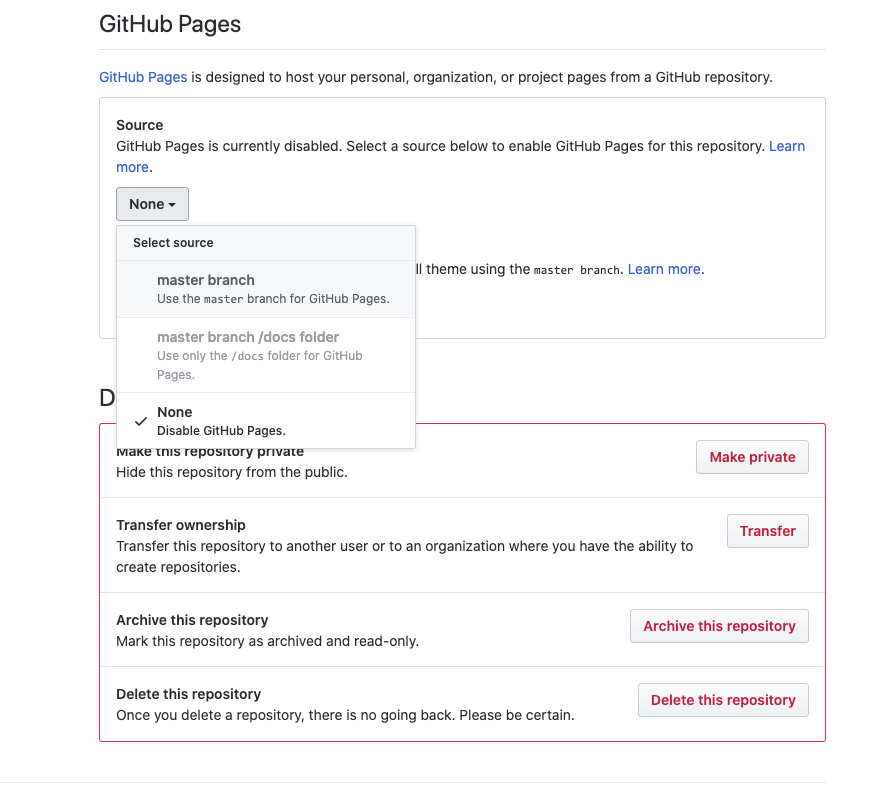

Visit Gotham City Website Project
=================================

[Visit Gotham City](https://liamoconnor87.github.io/VisitGotham/index.html)

Visit Gotham is a tourism website designed to appeal to a broad audience and attract customers to visit the city. The website has a simple layout so users are able to easily navigate a wealth of information and accompish the goal that led them to the website in the first place. The website uses large photos to showcase the city, representing a place customers will want to visit.

The features of the website make it useful for customers at any stage of their journey; before, during or after. The 'things to do' section is a useful hub of information on the many attactions Gotham has to offer, such as the Zoo, Educational Tours, Nightlife and The Batman Memorial. During a trip to Gotham the 'City info' section is great for Weather Updates, a City Map, Transportation and Local laws and Currency. Even once the trip is over the Newletter feature can keep you up to date on future events for your next visit.

UX
==

This website is focused at providing helpful information for users and attracting more to the City. Users visiting the website will be looking for;

>- Places to visit
>- Things to see and do
>- Culture and history of the City
>- Geographical info
>- Tranportation info
>- Safety info
>- Currency info

The Visit Gotham website is the best place to find all the above information in one place and is easy to use and navigate. For users looking for 'Places to visit' and 'Things to see and do' the websites 'Things to do' section has following sub-sections; 

>- Gotham Zoo, Museums & Galleries, Educational Tours, Activities, Sightseeing, Parks & Recreation, Nightlife, Bars & Resaurants and The Batman Memorial. 

For 'Culture and history of the City' the 'History' section has information on the follow; 

>- Folklore origins, 17th, 19th and 20th Century and the Legend of Batman. 

For 'Geographical, Transportation, safety and Currency information' the 'City info' section has detailed information on the following; 

>- Geography, Time Zone, Weather and Climate, Tours and Visitor Passes, Seasonal Events and Attractions, Transportation, Local Laws, Useful Phone Numbers, Currency, Safety, a City Map and Gotham State. 

Using all this information provided on the Visit Gotham website tourists will be able to safety plan and visit the City.

User Stories
--------------------
>- I would like a Navigation Bar so I can navigate the Website.

>>- As a User, I would like the websites logo on the Navigation Bar to take me back to the Home page.
>>- As a User, I would like a link on the Navigation Bar to the Things To Do page, so I can go to the Things To Do page.
>>- As a User, I would like a link on the Navigation Bar to the City Info, so I can go to the City Info page.
>>- As a User, I would like a link on the Navigation Bar to the History page, so I can go to the History page.

>- I would like the Home Page to have links to each section within the Things To Do page.

>>- As a User, I would like a link to the Gotham Zoo section, so I can go to the Gotham Zoo section on the Things To Do page.
>>- As a User, I would like a link to the Museums & Gallery section, so I can go to the Museums & Gallery section on the Things To Do page.
>>- As a User, I would like a link to the Educational Tours section, so I can go to the Educational Tours section on the Things To Do page.
>>- As a User, I would like a link to the Activities section, so I can go to the Activities section on the Things To Do page.
>>- As a User, I would like a link to the Sightseeing section, so I can go to the Sightseeing section on the Things To Do page.
>>- As a User, I would like a link to the Park & Recreation section, so I can go to the Park & Recreation section on the Things To Do page.
>>- As a User, I would like a link to the Nightlife section, so I can go to the Nightlife section on the Things To Do page.
>>- As a User, I would like a link to the Bars & Restaurants section, so I can go to the Bars & Restaurants section on the Things To Do page.
>>- As a User, I would like a link to the Batman Memorial section, so I can go to the Batman Memorial section on the Things To Do page.

>- I would like the Home Page to have links to each section within the City Info page.

>>- As a User, I would like a link to Basic Information section, so I can go to the Basic Information section on the City Info page.
>>- As a User, I would like a link to the Geography, Weather & Climate section, so I can go to the Geography, Weather & Climate section on the City Info page.
>>- As a User, I would like a link to the Tours & Visitors Pass section, so I can go to the Tours & Visitors Pass section on the City Info page.
>>- As a User, I would like a link to the Transportation section, so I can go to the Transportation section on the City Info page.
>>- As a User, I would like a link to the Local Laws & Currency section, so I can go to the Local Laws & Currency section on the City Info page.
 

>- I would like to be able to preview a map of Gotham City.

>>- As a User, I would like a downloadable map of Gotham City, so I have a copy for myself. 

>- As a User, I would like the websites contact information, so I am able to contact them directly.

>- I would like to be able to see which social media platforms the website is on. 

>>- As a User, I would like a link to the websites Facebook page, so I can visit there Facebook profile.
>>- As a User, I would like a link to the websites Twitter page, so I can visit there Twitter profile.
>>- As a User, I would like a link to the websites Instagram page, so I can visit there Instagram profile.

>- As a User, I would like to be able to enter my email adress, so I can subcribe to the websites news letter.

>- I would like a list of business bartners with Gotham City.

>>- As a User, I would like a link to the Gotham Zoo website, so I can go to the Gotham Zoo website.
>>- As a User, I would like a link to the Silver Lake Shopping Plaza website, so I can go to the Silver Lake Shopping Plaza website.
>>- As a User, I would like a link to the Monarch Theatre website, so I can go to the Monarch Theatre website.
>>- As a User, I would like a link to the Gotham Opera House website, so I can go to the Gotham Opera House website.
>>- As a User, I would like a link to the Wayne Enterprises website, so I can go to the Wayne Enterprises website.

>- As a User, I would like a scroll up feature at the bottom of each page, so I am able to go back to the top of the page.
>- As a User, I would like the City Info page to include a link to a map of Gotham City, so I can download a copy for myself.
>- As a User, on the City Info page I would like links to contact numbers and addresses, that are useful for when im visitng the city.
>- As a User, I would like the websites layout to be responsive, so I can visit the website on different smart devices. 

Mockups
-------
[**Index page**](assets/README_files/mockups/01-index.jpg)

[**Things To Do page**](assets/README_files/mockups/02-things-to-do.jpg)

[**City Info page**](assets/README_files/mockups/03-city-info.jpg)

[**History page**](assets/README_files/mockups/04-history.jpg)

Features
========

Exisiting Features
------------------
>- Fixed navigation bar - Allows the user to access the other pages of the website without needing to scroll up to the top of the page.

>- Scroll up feature -  Allows the user to go back up to the top of the page without needing to scroll up. 

>- Smart device version - Allows the user to access the website on other smart devices. 

>- Clear layout & navigation - Simple layout and navigation allows the user to understand the website easily.

>- Preview of a map of Gotham City - Allows the user to preview and download a map of the city. 

>- Newsletter Sign Up - Allows users to sign up for a newsletter using their email address.

>- Contact Information - Allows users to contact the website directly using Postal Address, Phone Number and Email Address. 

>- Social Media Platforms - Allows users to connect with the website through it's social media pages.

>- Information about Gotham City - Allows users to obtain a wealth of information about the City; past and present. 

Features Left to Implement
--------------------------
>- Live Weather Update - Allows the user to see what the weather is currently in Gotham City and also projected weather for the comging week. 

>- Things to do sub catergories - Allows the user to see in more depth a list of things to do in the city including prices, links to activities and businesses associated to it.

>- Map of City using a Modal - Allows the user to view the map with a better presentation. 

Technologies Used
=================

>- [HTML](https://html.com) - The project uses HTML to create the pages of the website. 
>- [CSS](https://www.w3.org/Style/CSS) - The project uses CSS to style the websites pages. 
>- [Fontawesome](https://fontawesome.com) - The project uses some icons from this Library to style some of the website.
>- [Git](https://git-scm.com) - The project uses to Git to push the project on to the Github repository.
>- [Github](https://github.com) - The project uses Github repository to store the website.
>- [Github Pages](https://pages.github.com) - The project uses Github pages to host the website.
>- [Gitpod](https://gitpod.io) - The project uses Gitpod IDE to facilitate building the website.
>- [W3Schools](https://www.w3schools.com) - The project used helpful tutorials to help build the website. 
>- [Validator](https://validator.w3.org) - The project used this website to validate teh HTML and CSS code for the website.
>- [Adobe Photoshop](https://www.adobe.com/uk/products/photoshop.html) - The project used this software to design the layouts of pages, logos of businesses and to crop and edit images used on the website. 

Testing
=======

Header & Navigation Bar
-----------------------
>1. Go to the Visit Gotham website.
>2. Click on Things To Do link to verify it takes you to the Things To Do page.
>3. Click on City Info link to verify it takes you to the City Info page.
>4. Click on History link to verify it takes you to the History page.
>3. Click on Visit Gotham logo to verify it takes you to the Home page.
>5. Repreat process for every page. 

Home page's links to Things To Do sections
------------------------------------------
>1. Click on the Gotham City Zoo link to verify it takes you to the Gotham City Zoo section on the Things To Do page.
>2. Click on the Museums & Galleries link to verify it takes you to the Museums & Galleries section on the Things To Do page.
>3. Click on the Educational Tours link to verify it takes you to the Educational Tours section on the Things To Do page.
>4. Click on the Activities link to verify it takes you to the Activities section on the Things To Do page.
>5. Click on the Sightseeing link to verify it takes you to the Sightseeing section on the Things To Do page.
>6. Click on the Parks & Recreation link to verify it takes you to the Parks & Recreation section on the Things To Do page.
>7. Click on the Nightlife link to verify it takes you to the Nightlife section on the Things To Do page.
>8. Click on the Bars & Restaurants link to verify it takes you to the Bars & Restaurants section on the Things To Do page.
>9. Click on the The Batman Memorial link to verify it takes you to the The Batman Memorial section on the Things To Do page.

Home page's links to City Info sections
---------------------------------------
>1. Click on the Basic Information link to verify it takes you to the Basic Information section on the City Info page.
>2. Click on the Geography/Weather/Climate link to verify it takes you to the Geography/Weather/Climate section on the City Info page.
>3. Click on the Tours & Visitors Pass link to verify it takes you to the Tours & Visitors Pass section on the City Info page.
>4. Click on the Transportation link to verify it takes you to the Transportation section on the City Info page.
>5. Click on the Local Laws & Currency link to verify it takes you to the Local Laws & Currency section on the City Info page.

Gotham City Map preview
-----------------------
>1. Go to the Gotham City Map link on the Home page.
>2. Click on the Gotham City Map link to verify it shows a preview of the Gotham City map.
>3. Click on the Close link to verify it closes the preview. 
>4. Click outside the preview to verify it closes the preview.
>5. Click on the Download link to verify it will download to device.

Contact Information
-------------------
>1. Go to the Contact Information section.
>2. Specifically for smart phones. Click on phone number link to verify it will open the phone app on the device.
>3. Click on the email address to verify it will open the email app on the device. 
>4. Repeat process for every page.

Social Media links (Dead links)
------------------
>1. Go to the Social Media section. 
>2. Click on the Facebook Icon to verify it takes you to Facebook.
>3. Click on the Twitter Icon to verify it takes you to Twitter.
>2. Click on the Instagram Icon to verify it takes you to Instagram.

Newsletter Sign Up
------------------
>1. Go to the Newsletter Sign Up section.
>2. Try to submit the empty form and verify that an error message about the required fields appears.
>3. Try to submit the form with an invalid email address and verify that the relevant error message appears.
>4. Try to submit the form with a valid email address to verify that as successful message appears.

Business Partners (Dead links)
-----------------
>1. Go to the Business Partners section. 
>2. Click on the Business logo to verify it goes to the relevant site.
>3. Repeat for each business partner.
>4. Repeat process for every page.

City Info page - Gotham Map Download
-------------------------------------
>1. Go to the City Info page.
>2. Go to the Georgraphy section. 
>3. Click on the Click here to download a Map of Gotham City link to verify it downloads the map to the device.

City Info page - Information Links (Dead links)
----------------------------------
>1. Go to the City Info page.
>2. Go to the Tours & Visitors Pass section.
>3. Click on the **Visit our Tours page** link to verify it works. 
>4. Repeat process for **visit our calendar** link in the Seasonal Events & Attractions section.
>5. Repeat process for **gothamgo** and **read our tips for visitors** link in the Safey section.
>6. Repeat process for **ilovegotham** link in the Gotham State section.

City Info page - Phone Numbers
------------------------------
>1. Specifically for smart phones. Click on the phone number links in the Useful Phone Numbers section to verify it will open the phone app on the device.
>2. Repeat process for the Currency section.

Scroll Up Feature
-----------------
>1. Go to Scroll Up feature at the bottom of the page.
>2. Click on the icon to verify it takes you back to the top of the page you are on. 
>3. Repeat process for every page.

Browser test
------------
>1. Open Browser on device.
>2. Enter https://liamoconnor87.github.io/VisitGotham/index.html#banner in to address bar. 
>3. Verify the website works in the browser. 
>4. Repeat process for multiple browsers - Internet Explorer, Google Chrome, Safari, Firefox, Opera, Vivaldi. 

Responsive layout
-----------------
>1. Go to the Visit Gotham website. 
>2. Make browser window full screen to verify the layout is correct. 
>3. Resize the browser window smaller to check the layout responds to different sizes. 
>4. You can also do this by using the Toggle device toolbar in Chrome. It lists a few specific device sizes that you can check the layout works with.

Automated checks
----------------
>- I used the W3C's Validator to check my HTML and CSS code.

Bugs or Problems
----------------
- Modal wouldnt work without errors. 
- Scroll up feature wouldnt work after creating a fixed bar. 

Deployment
==========

Github Pages was used to deploy this website. In order to do this you will need to take the following steps;

>- Go to the Github website and log in or create an account. You will need an account in order to create a repository for your website.
>- Log in to your account.
>- There are two ways to create a repository depending on whether this is a new account or not. 

>- For a new account the link to create a Github repository would be seen on the home page.
> 

>- For an account that is not new your landing page will be your dashboard in which your looking for the **New** button in **green** on the left hand side of the page. 
> 

>- Both of these steps will take you to the next page which is the Github Repository creation page.
>- You will need to give your repository a name that is unique. Github will indicate this with **green tick** next to the name.
> 
>- Fill up the other options given on the page and press **Create repository**. 
>- Now its created, you need to push your code to the repository by using the command line.
> 

>- From the command line you will need to do the following;
>>- Change directory to where the files are located. For example your html file is located on your C drive on your desktop in a folder called test, you would use the **cd** commands to change directory to - C:User/desktop/test.
>>- Run Git using the **git init** command.
>>- Then add the file you want to push. For example **git add test.html**
>>- Then commit file. For example **git commit -m "first commit"**
>>- At this point you will be following commands that Github has provided for pushing "an existing repositry."
>> 
>>- The command line will then prompt you to provide your **Github** **Username** and then **Password**, in order for it to push the files to the repository you created.

>- This is now ready to be deployed on to Github Pages. Refreshing the page at this point should change the screen and show that your file has been pushed to the repository.
>
>- Now select **Settings** in the top right corner of the page and it should take you this tab.
>
>- Scroll down to the GitHub Pages section and change the source tab from **None** to **master branch**.
>
>- This will automatically refresh the page to update the changes.
>- Scroll back down to the GitHub Pages section to find the address to your new published website. It should look similar to this. 
>

>- Clicking on the link should take you to the hosted website. Hazar!

Running Code Locally
--------------------
>- Go to GitHub Repositry.
>- Click on the **Clone or Download** button in **green** and select **Download Zip**.
>
>- Once youve located the Zip file on your device. Open the files in your browser. 

Credits
=======

Content
-------
>- The text for Gotham Zoo section was copied and edited from the [Central Park Zoo About page](https://centralparkzoo.com/about)
>- The text for Museum & Galleries section was copied and edited from the [NYCgo Museum & Galleries page](https://www.nycgo.com/things-to-do/museums-galleries)
>- The text for Educational Tours section was copied and edited from the [Visit New York Educational Tours page](https://www.visitnewyork.com/educational-tours/)
>- The text for Activities section was copied and edited from the [NYCgo Activities page](https://www.nycgo.com/broadway-show-tickets-nyc/)
>- The text for Park & Recreation section was copied and edited from the [NYC Park About page](https://www.nycgovparks.org/about)
>- The text for Nightlife section was copied and edited from the [NYC Travel Online Nightlife page](https://nyctravelonline.wordpress.com/night-life/)
>- The text for Bars & Restaurants section was copied and edited from the [Choose Chicago Food & Drink page](https://www.choosechicago.com/things-to-do/food-drink/)
>- The text for The Batman Memorial section was copied and edited from the [NYCgo 9/11 Memorial & Museum page](https://www.choosechicago.com/things-to-do/food-drink/)
>- The text for the City Information page was copied and edited from the [NYCgo Basic Information page](https://www.nycgo.com/plan-your-trip/basic-information/)
>- The text for the History page was copied and edited from the [DC Fandom Gotham City page](https://https://dc.fandom.com/wiki/Gotham_City/)

Media
-----
The photos used in this site were obtained from the following;

>- Index page top banner image from [Pexels](architectural-photography-of-tunnel-2088233)
>- Index page bottom banner image from [Roadway Moving](https://www.roadwaymoving.com/blog/moving-from-nyc-to-chicago/)
>- Things To Do page banner image from [Pixabay](https://pixabay.com/photos/chicago-chicago-river-1411272/)
>- City Info page banner image from [Roof Meadow](https://roofmeadow.wordpress.com/2011/06/07/chicago-city-hall-chicago-il-2/)
>- History page banner image from [Pexels](https://www.pexels.com/photo/photo-of-brooklyn-bridge-new-york-2260783/)
>- Gotham City Zoo image for Index and Things To Do page from [Fight For Rhinos](https://fightforrhinos.files.wordpress.com/2015/11/southern-whites-in-san-diego.jpg)
>- Museums & Galleries image for Index and Things To Do page from [Guggenheim Museum](https://www.guggenheim.org)
>- Educational Tours image for Index and Things To Do page from [Chicago Tribune](https://www.chicagotribune.com/entertainment/ct-xpm-2014-05-07-ct-chicago-architecture-foundation-tours-20140507-story.html)
>- Activities image for Index and Things To Do page from [Neighborhoods](https://www.neighborhoods.com/blog/6-winter-outdoor-activities-and-where-to-do-them-around-chicago)
>- Sightseeing image for Index and Things To Do page from [Destination 360](http://www.destination360.com/north-america/us/illinois/chicago/chicago-tours)
>- Park & Recreation image for Index and Things To Do page from [Traveldigg](https://traveldigg.com/the-fascination-of-hyde-park-london-england/)
>- Nightlife image for Index and Things To Do page from [Dancing Astonaut](https://dancingastronaut.com/2019/01/new-york-nightlife-sector-unsurprisingly-booming-according-new-economic-impact-study-city-nightlife-mayors-office/)
>- Bars & Restaurants image for Index and Things To Do page from [Asia-Bars](https://www.asia-bars.com/wp-content/uploads/2013/07/catalunya-hong-kong-7.jpg)
>- The Batman Memorial image for Index and Things To Do page from [Comic Book Movie](http://images.fandango.com/MDCsite/images/featured/201211/tdkr-batman-statue.jpg)
>- Monarch Theatre Logo from the Business Partner Section is from [Editing Luke](http://www.editingluke.net/2009/10/monarch-theatre-project-medicine-hat.html)
>- The map of Gotham City image is from [Gotham City Wikipedia page](https://en.wikipedia.org/wiki/Gotham_City)
>- The Dutch Navy Image is from [Retro Richie's Youtube file found on google image search](https://i.ytimg.com/vi/wBFHpG9AGzg/maxresdefault.jpg)
>- The image of Henry Hudson is from [History.com](https://www.history.com/topics/exploration/henry-hudson)
>- The image of 19th Century New York City is from [Things I Enjoy](http://thethingsienjoy.blogspot.com/2012/08/three-busy-port-cities-in-late-19th.html)
>- The image of 19th Century Judge is from [Skiner Inc.](https://www.skinnerinc.com/auctions/2513/lots/730)
>- The image of 20th Century criminals is from [Vintage Everyday](https://3.bp.blogspot.com/-NpA8LEE7kME/WNwGxVs-dqI/AAAAAAACn4E/p2koovkHGGAJu4c-LylNxKFT5DukPPOrgCLcB/s1600/american-gangsters-1920s-30s-4.jpeg)
>- The image of the other 20th Century criminals is from [Hypness](https://www.hypeness.com.br/2017/04/serie-de-fotos-em-pb-capta-a-experiencia-de-ser-negro-na-chicago-dos-anos-1940/)
>- The image of Batman flying is from [Gizmodo](https://www.gizmodo.co.uk/2012/07/science-shows-that-flying-using-batmans-cape-would-definitely-kill-you/)
>- The image of Batman above the city [Tom's Hardware](https://www.tomshardware.com/uk/news/batman-arkham-knight-hands-on,29466.html)

Acknowledgements
----------------
>- I recieved inspiration for this project from [Visit New York](https://www.visitnewyork.com)
>- I recieved inspiration for this project from [NYCgo](https://www.nycgo.com)
>- I recieved inspiration for this project from [Central Park Zoo](https://centralparkzoo.com)
>- I recieved mentorship on this project from Precious "Jedi Master" Ijege.