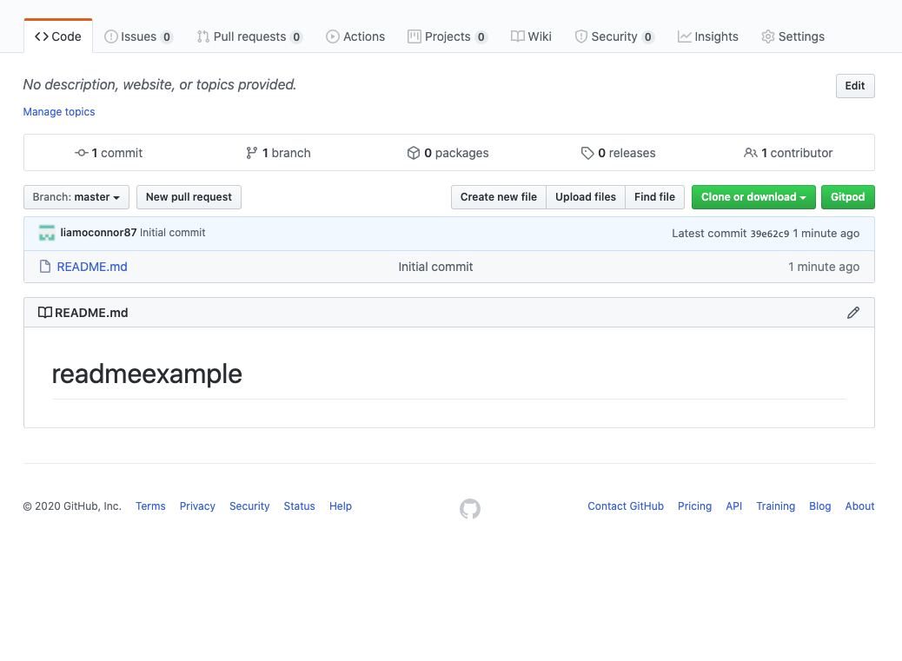
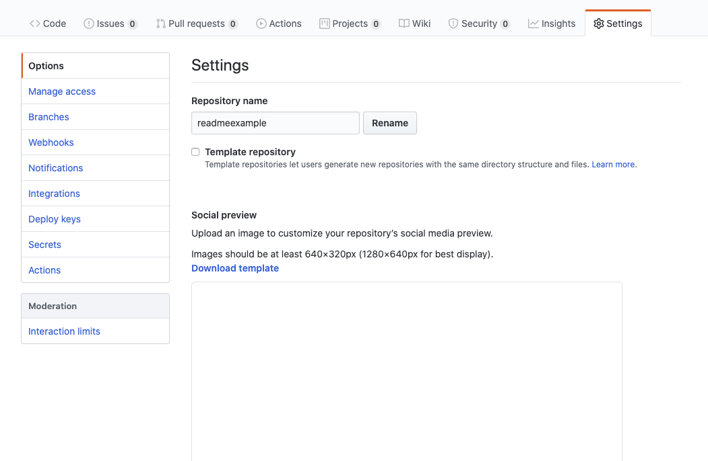
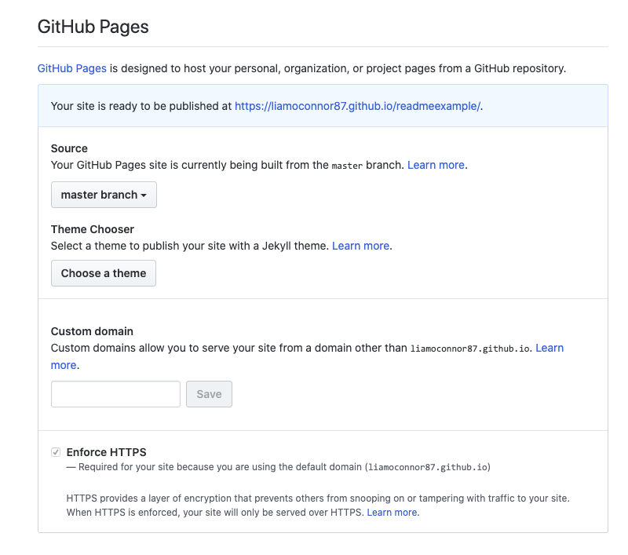
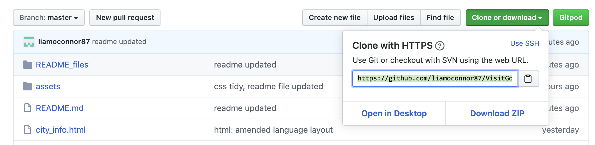

Visit Gotham City Website Project
=================================

**Website** - [Visit Gotham City](https://liamoconnor87.github.io/VisitGotham/index.html)

Visit Gotham is a tourism website designed to appeal to a broad audience and attract customers to visit the city. The website has a simple layout so users are able to 
easily navigate a wealth of information and accomplish the goal that led them to the website in the first place. The website uses large photos to showcase the city, 
representing a place customers will want to visit.

The features of the website make it useful for customers at any stage of their journey; before, during or after. The 'things to do' section is a useful hub of information 
on the many attractions Gotham has to offer, such as the Zoo, Educational Tours, Nightlife and The Batman Memorial. During a trip to Gotham the 'City info' section is great 
for Weather Updates, a City Map, Transportation and Local laws and Currency. Even once the trip is over the Newsletter feature can keep you up to date on future events for 
your next visit.

UX
==

This website is focused at providing helpful information for users and attracting more to the City. Users visiting the website will be looking for;

- Places to visit
- Things to see and do
- Culture and history of the City
- Geographical info
- Transportation info
- Safety info
- Currency info

The Visit Gotham website is the best place to find all the above information in one place and is easy to use and navigate. For users looking for 'Places to visit' and 'Things to see and do' the websites 'Things to do' section has following sub-sections; 

>Gotham City Zoo, Museums & Galleries, Educational Tours, Activities, Sightseeing, Parks & Recreation, Nightlife, Bars & Restaurants and The Batman Memorial. 

For 'Culture and history of the City' the 'History' section has information on the following; 

>Folklore origins, 17th, 19th and 20th Century and the Legend of Batman. 

For 'Geographical, Transportation, safety and Currency information' the 'City info' section has detailed information on the following; 

>Geography, Time Zone, Weather and Climate, Tours and Visitor Passes, Seasonal Events and Attractions, Transportation, Local Laws, Useful Phone Numbers, Currency, Safety, a City Map and Gotham State. 

Using all this information provided on the Visit Gotham website tourists will be able to safety plan and visit the City.

User Stories
--------------------
- I would like a Navigation Bar, so I can navigate the Website.

- As a User, I would like the website's logo on the Navigation Bar to take me back to the Home page.
- As a User, I would like a link on the Navigation Bar to the Things To Do page, so I can go to the Things To Do page.
- As a User, I would like a link on the Navigation Bar to the City Info, so I can go to the City Info page.
- As a User, I would like a link on the Navigation Bar to the History page, so I can go to the History page.

- I would like the Home Page to have links to each section within the Things To Do page.

- As a User, I would like a link to the Gotham Zoo section, so I can go to the Gotham Zoo section on the Things To Do page.
- As a User, I would like a link to the Museums & Gallery section, so I can go to the Museums & Gallery section on the Things To Do page.
- As a User, I would like a link to the Educational Tours section, so I can go to the Educational Tours section on the Things To Do page.
- As a User, I would like a link to the Activities section, so I can go to the Activities section on the Things To Do page.
- As a User, I would like a link to the Sightseeing section, so I can go to the Sightseeing section on the Things To Do page.
- As a User, I would like a link to the Park & Recreation section, so I can go to the Park & Recreation section on the Things To Do page.
- As a User, I would like a link to the Nightlife section, so I can go to the Nightlife section on the Things To Do page.
- As a User, I would like a link to the Bars & Restaurants section, so I can go to the Bars & Restaurants section on the Things To Do page.
- As a User, I would like a link to the Batman Memorial section, so I can go to the Batman Memorial section on the Things To Do page.

- I would like the Home Page to have links to each section within the City Info page.

- As a User, I would like a link to Basic Information section, so I can go to the Basic Information section on the City Info page.
- As a User, I would like a link to the Geography, Weather & Climate section, so I can go to the Geography, Weather & Climate section on the City Info page.
- As a User, I would like a link to the Tours & Visitors Pass section, so I can go to the Tours & Visitors Pass section on the City Info page.
- As a User, I would like a link to the Transportation section, so I can go to the Transportation section on the City Info page.
- As a User, I would like a link to the Local Laws & Currency section, so I can go to the Local Laws & Currency section on the City Info page.

- I would like to be able to preview a map of Gotham City.

- As a User, I would like a downloadable map of Gotham City, so I have a copy for myself. 
- As a User, I would like the websites contact information, so I am able to contact them directly.

- I would like to be able to see which social media platforms the website is on. 

- As a User, I would like a link to the websites Facebook page, so I can visit there Facebook profile.
- As a User, I would like a link to the websites Twitter page, so I can visit there Twitter profile.
- As a User, I would like a link to the websites Instagram page, so I can visit there Instagram profile.
- As a User, I would like to be able to enter my email address, so I can subscribe to the website's newsletter.

- I would like a list of business partners with Gotham City.

- As a User, I would like a link to the Gotham Zoo website, so I can go to the Gotham Zoo website.
- As a User, I would like a link to the Silver Lake Shopping Plaza website, so I can go to the Silver Lake Shopping Plaza website.
- As a User, I would like a link to the Monarch Theatre website, so I can go to the Monarch Theatre website.
- As a User, I would like a link to the Gotham Opera House website, so I can go to the Gotham Opera House website.
- As a User, I would like a link to the Wayne Enterprises website, so I can go to the Wayne Enterprises website.
- As a User, I would like a scroll up feature at the bottom of each page, so I am able to go back to the top of the page.
- As a User, I would like the City Info page to include a link to a map of Gotham City, so I can download a copy for myself.
- As a User, on the City Info page I would like links to contact numbers and addresses that are useful for when I'm visiting the city.
- As a User, I would like the website's layout to be responsive, so I can visit the website on different smart devices. 

Wireframe
---------
I used Adobe Photoshop to create wireframes in desktop, tablet and phone view.
**add links**

Features
========

Existing Features
------------------
All 4 pages have a fixed navigation bar that allows you at any point to go to each page. They also have the same footer, consisting of a Contact Us section, links to the 
websites social media platforms, a Newsletter sign up feature, links to the City's Business Partners and a scroll to top feature that allows the user to pop straight back 
to the top of the page. 
I used the font Ubuntu throughout the website, which has a 
simple and clean look to it. Each Page also has a hero (or) banner image at the top with a title. I wanted a consistent start to each page, but then change each way the 
information is presented whilst keeping it inline with the style of website. The colour scheme of the website was is a mix of Black, Gray and White, which suits the Gothic 
feel of the City. I would then use accents of dark red and dark green to highlight certain links or features, as well as yellow, mainly for sections to do with Batman in 
order to signify these sections as special interest.

## [Landing Page](https://liamoconnor87.github.io/VisitGotham/index.html)

Top of the landing page has a hero image which is a distant view of the Gotham City. This is representing the idea of space between the user and Gotham. 
As you go down the page you see Gotham's slogan; 'Your origin story starts here'. This is designed to inspire the user further to choose Gotham as a 
destination and to sell you the idea of a great adventure, a story you could tell. As well as allude to Gotham's past hero's and deliberately make the user align 
themselves with them. 

The first section you come to is titled Things to do. It displays examples of things you can do in the city as a picture with a title underneath in a grid format. Each 
image and title links to that section on the Things To Do page. When you hover over the titles the colour changes from grey and white to black and white. Except for 
the Batman Memorial which goes from grey and white to black and yellow.

After this is a second banner image, designed to show case the city again visually with some interesting architecture, but also show a divide between the first and second section. 

The second section is titled City Info. This displays a series of links to certain sections on the City Info page. For consistency again displayed in a grid format in dark 
green and white, and as you hover over the title changes to black and white. 

At the bottom is the footer signifying the end of the page. 

## [Things To Do Page](https://liamoconnor87.github.io/VisitGotham/things_to_do.html)

At the top of the page it has a hero image which is a bird's eye view of two people kayaking down one of Gotham's rivers on St Patrick's day. The water is green, its an interesting 
image that entices the user to continue down the page to learn about things you can do in the city. The green of the image also stays consistent with the colour scheme of the website.

The title of the page Things To Do follows underneath as a way of reaffirming the users interest and what the page is about. 

The next section is broken up into nine categories with a brief description of things you can do in the city. These sections are the same as the landing page. Each category alternate 
in presentation. At desktop view go the first category is displayed with the image on the left with information to the right in grey and white. This presentation of the second category 
is alternated to image on the right with the information on the left now in black and white. This style alternates between these layouts and colours with each category as you go down 
the page. Once again to signify it's on individual importance, when you reach The Batman Memorial section. The colour scheme changes to black and yellow. 

At the bottom is the footer signifying the end of the page. 

## [City Info Page](https://liamoconnor87.github.io/VisitGotham/city_info.html)
At the top of the page it has a hero image of Gotham City's Town Hall. This is to represent a more official or serious consideration when the user is on this page. 
The title of the page, City Information follows underneath as a way of reaffirming the users interest and what the page is about. 

Following the title is a short official statement from the City on Covid-19. It is highlighted in red and white and covers the width of the page. This is 
designed to give it more relevance and importance for the user to see it.

Next is the City Information section. It's in an article format with a grey background and black font. This is to convey the information in a more serious tone and 'matter of fact' 
and is broken up into paragraphs that are easily readable for the user. 
In this section you also have links to other helpful material and phone numbers that the user might need when visiting Gotham. 

At the bottom is the footer signifying the end of the page. 

## [History Page](https://liamoconnor87.github.io/VisitGotham/history.html)
At the top of the page it has a hero image of Gotham City taken from Arkham Bridge, as this a page on Gotham's history this image of the skyline with cranes gave a good 
representation of Gotham continuous improvement from its dark past. 
The title of the page, Gotham's History follows underneath as a way of reaffirming the users interest and what the page is about.

Underneath this the page is broken into the following 5 categories;
- Folklore's Origins
- 17th Century
- 19th Century
- 20th Century
- Legend of Batman. 

Each paragraph is broken up with images alternating in there position as you go down the page as well as the paragraphs changing background colour from grey to black with white font. 
Of course when the user comes to the Legend of Batman section the background is yellow and the font is black. Again to highlight its significance. All the images correlate with there 
related information. For example; Legend of Batman section has images of Batman. 

At the bottom is the footer signifying the end of the page. 

## [Gotham City Map Preview](https://liamoconnor87.github.io/VisitGotham/gotham_map.html)
This page simply displays a preview Map of Gotham City. To signify this, the image is centred on the page titled with Gotham City Map with a grey background behind it. 
It has two features. A Return link to go back to the previous page and a download link so the user can keep copy should they visit. 

Technologies Used
=================

[HTML](https://html.com) - The project uses HTML to create the pages of the website.

[CSS](https://www.w3.org/Style/CSS) - The project uses CSS to style the websites pages.

[Google Fonts](https://fonts.google.com) - The project uses this for a font on the website.

[Fontawesome](https://fontawesome.com) - The project uses this for some icons for the website.

[Git](https://git-scm.com) - The project uses to Git to push the project on to the Github repository.

[GitHub](https://github.com) - The project uses GitHub repository to store the website.

[GitHub Pages](https://pages.github.com) - The project uses GitHub pages to host the website.

[Gitpod](https://gitpod.io) - The project uses Gitpod IDE to facilitate building the website.

[Validator](https://validator.w3.org) - The project used this website to validate the HTML for the website.

[Jigsaw](https://jigsaw.w3.org/css-validator/) - The project used this website to validate the CSS for the website.

[Adobe Photoshop](https://www.adobe.com/uk/products/photoshop.html) - The project used this software to design the layouts of pages, logos of businesses and to crop and edit images used on the website. 

Testing
=======
Is on a seperate document - [testing.md](testing.md)

Deployment
==========

GitHub Pages were used to deploy this website, in order to do this you will need to take the following steps;

>1. Go to the GitHub repository.
>
>2. Now select **Settings** in the top right corner of the page and it should take you this tab.
>
>3. Scroll down to the GitHub Pages section and change the source tab from **None** to **master branch**.
>
>4. This will automatically refresh the page to update the changes.
>5. Scroll back down to the GitHub Pages section to find the address to your new published website. The page should look similar to this. 
>

>6. Clicking on the link should take you to the hosted website. **Hazar!**

Running Code Locally
--------------------
>1. Go to GitHub Repositry. -https://github.com/liamoconnor87/VisitGotham
>2. Click on the **Clone or Download** button in **green** and copy the URL link to the repository in the address box - https://github.com/liamoconnor87/VisitGotham.git
>
>3. Head into your terminal and **cd** to the path where you would like to clone the repository.
>4. Type into terminal - **git clone https://github.com/liamoconnor87/VisitGotham.git**. This should download your repository to your designated folder.
>5. Once this is downloaded, you can run the files through your browser to check it works.

Credits
=======

Content
-------
- The text for Gotham Zoo section was copied and edited from the [Central Park Zoo About page](https://centralparkzoo.com/about)
- The text for Museum & Galleries section was copied and edited from the [NYCgo Museum & Galleries page](https://www.nycgo.com/things-to-do/museums-galleries)
- The text for Educational Tours section was copied and edited from the [Visit New York Educational Tours page](https://www.visitnewyork.com/educational-tours/)
- The text for Activities section was copied and edited from the [NYCgo Activities page](https://www.nycgo.com/broadway-show-tickets-nyc/)
- The text for Park & Recreation section was copied and edited from the [NYC Park About page](https://www.nycgovparks.org/about)
- The text for Nightlife section was copied and edited from the [NYC Travel Online Nightlife page](https://nyctravelonline.wordpress.com/night-life/)
- The text for Bars & Restaurants section was copied and edited from the [Choose Chicago Food & Drink page](https://www.choosechicago.com/things-to-do/food-drink/)
- The text for The Batman Memorial section was copied and edited from the [NYCgo 9/11 Memorial & Museum page](https://www.choosechicago.com/things-to-do/food-drink/)
- The text for the City Information page was copied and edited from the [NYCgo Basic Information page](https://www.nycgo.com/plan-your-trip/basic-information/)
- The text for the History page was copied and edited from the [DC Fandom Gotham City page](https://https://dc.fandom.com/wiki/Gotham_City/)
- The CSS flex feature used in the layout of website was from the tutorials on [W3Schools](https://www.w3schools.com)
- The form feature used in this was taken and adapted from the Code Institute Exercise 'Love Running' [Code Institute](codeinstitute.net/)

Media
-----
The photos used in this site were obtained from the following;

- Index page top banner image from [Pexels](architectural-photography-of-tunnel-2088233)
- Index page bottom banner image from [Roadway Moving](https://www.roadwaymoving.com/blog/moving-from-nyc-to-chicago/)
- Things To Do page banner image from [Pixabay](https://pixabay.com/photos/chicago-chicago-river-1411272/)
- City Info page banner image from [Roof Meadow](https://roofmeadow.wordpress.com/2011/06/07/chicago-city-hall-chicago-il-2/)
- History page banner image from [Pexels](https://www.pexels.com/photo/photo-of-brooklyn-bridge-new-york-2260783/)
- Gotham City Zoo image for Index and Things To Do page from [Fight For Rhinos](https://fightforrhinos.files.wordpress.com/2015/11/southern-whites-in-san-diego.jpg)
- Museums & Galleries image for Index and Things To Do page from [Guggenheim Museum](https://www.guggenheim.org)
- Educational Tours image for Index and Things To Do page from [Chicago Tribune](https://www.chicagotribune.com/entertainment/ct-xpm-2014-05-07-ct-chicago-architecture-foundation-tours-20140507-story.html)
- Activities image for Index and Things To Do page from [Neighborhoods](https://www.neighborhoods.com/blog/6-winter-outdoor-activities-and-where-to-do-them-around-chicago)
- Sightseeing image for Index and Things To Do page from [Destination 360](http://www.destination360.com/north-america/us/illinois/chicago/chicago-tours)
- Park & Recreation image for Index and Things To Do page from [Traveldigg](https://traveldigg.com/the-fascination-of-hyde-park-london-england/)
- Nightlife image for Index and Things To Do page from [Dancing Astronaut](https://dancingastronaut.com/2019/01/new-york-nightlife-sector-unsurprisingly-booming-according-new-economic-impact-study-city-nightlife-mayors-office/)
- Bars & Restaurants image for Index and Things To Do page from [Asia-Bars](https://www.asia-bars.com/wp-content/uploads/2013/07/catalunya-hong-kong-7.jpg)
- The Batman Memorial image for Index and Things To Do page from [Comic Book Movie](http://images.fandango.com/MDCsite/images/featured/201211/tdkr-batman-statue.jpg)
- Monarch Theatre Logo from the Business Partner Section is from [Editing Luke](http://www.editingluke.net/2009/10/monarch-theatre-project-medicine-hat.html)
- The map of Gotham City image is from [Gotham City Wikipedia page](https://en.wikipedia.org/wiki/Gotham_City)
- The Dutch Navy Image is from [Retro Richie's Youtube file found on google image search](https://i.ytimg.com/vi/wBFHpG9AGzg/maxresdefault.jpg)
- The image of Henry Hudson is from [History.com](https://www.history.com/topics/exploration/henry-hudson)
- The image of 19th Century New York City is from [Things I Enjoy](http://thethingsienjoy.blogspot.com/2012/08/three-busy-port-cities-in-late-19th.html)
- The image of 19th Century Judge is from [Skinner Inc.](https://www.skinnerinc.com/auctions/2513/lots/730)
- The image of 20th Century criminals is from [Vintage Everyday](https://3.bp.blogspot.com/-NpA8LEE7kME/WNwGxVs-dqI/AAAAAAACn4E/p2koovkHGGAJu4c-LylNxKFT5DukPPOrgCLcB/s1600/american-gangsters-1920s-30s-4.jpeg)
- The image of the other 20th Century criminals is from [Hypness](https://www.hypeness.com.br/2017/04/serie-de-fotos-em-pb-capta-a-experiencia-de-ser-negro-na-chicago-dos-anos-1940/)
- The image of Batman flying is from [Gizmodo](https://www.gizmodo.co.uk/2012/07/science-shows-that-flying-using-batmans-cape-would-definitely-kill-you/)
- The image of Batman above the city [Tom's Hardware](https://www.tomshardware.com/uk/news/batman-arkham-knight-hands-on,29466.html)

Acknowledgements
----------------
- I received inspiration for this project from [Visit New York](https://www.visitnewyork.com)
- I received inspiration for this project from [NYCgo](https://www.nycgo.com)
- I received inspiration for this project from [Central Park Zoo](https://centralparkzoo.com)
- I received mentorship on this project from [Precious 'Jedi Master' Ijege](https://www.linkedin.com/in/precious-ijege-908a00168/)